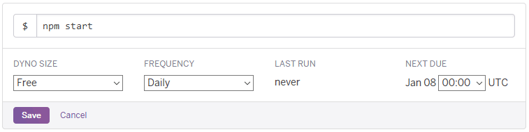

# counted

Use Heroku Scheduler to capture and store `download_count` values
for assets distributed via GitHub Releases.

1. Click the `Deploy to Heroku` button above.
2. Enter a unique-to-Heroku `App name`.
3. Choose a region, one of US or Europe.
4. Fill in the `Config Variables` with the values for your GitHub repository.
    * `GITHUB_OWNER`: GitHub username that owns the repository, e.g. `lovell`.
    * `GITHUB_REPO`: Name of the repository, e.g. `counted`.
    * `GITHUB_AUTH_TOKEN`: GitHub [Personal Access Token](https://github.com/settings/tokens/new) granted `public_repo` scope access.
    * `REPO_BRANCH`: Git branch to use for commits, default value is `counted`.
    * `REPO_DIRECTORY`: Directory to use to store data, default value is `counted`.
    * `COMMITTER_NAME`: Git `user.name` for this task to commit as, default value is `counted`.
    * `COMMITTER_EMAIL`: Git `user.email` for this task to commit as, default value is `counted@users.noreply.github.com`.
5. Click `Deploy app` and wait for the `Your app was successfully deployed` message.
6. Click `Manage App`.
7. Click the `Resources` tab.
8. Click `Heroku Scheduler` under `Add-ons`.
9. Click `Add new job` and enter the following details: 
    * $: `npm start`
    * Frequency: Daily
    * Next due: 00:00
10. Click `Save`.
